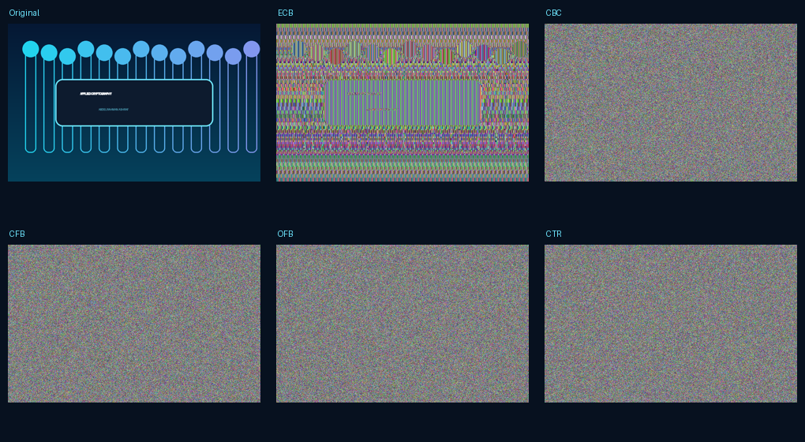

# Applied Cryptography Lab

An interactive Python lab that turns four Information Security college exercises into a tested command-line project. It demonstrates a reversible Feistel network, an unauthenticated Diffie-Hellman man-in-the-middle exchange, five AES image modes, and a small DSA-style signature workflow.

Built and maintained by **Abdelrahman Ashraf**.



## What changed from the course version

- Accepts a message or **any user-selected image path** instead of hard-coded input.
- Preserves complete AES ciphertext so every mode can be decrypted and verified.
- Generates a comparison board and a JSON manifest with hashes and parameters.
- Signs the actual user message and proves that a modified message fails verification.
- Validates inputs, separates reusable modules from the CLI, and includes tests.
- Preserves the initial scripts under `legacy/` to show the development history.

## Install

```bash
python -m venv .venv
# Windows
.venv\Scripts\activate
python -m pip install -e ".[dev]"
```

## Use

Choose your own image from the command line:

```bash
crypto-lab image-modes "C:\path\to\your-image.jpg" --output mode_results
```

If you omit the path, the program asks for it interactively:

```bash
crypto-lab image-modes
```

Run the remaining lessons:

```bash
crypto-lab feistel --message "Hello Abdelrahman"
crypto-lab dh-mitm
crypto-lab dsa --message "Integrity matters" --nonce 15
```

The fixed DSA nonce makes classroom output repeatable. Omit `--nonce` to generate a fresh value. Never reuse a DSA nonce in a real system.

## Test

```bash
python -m pytest
```

The tests cover text and binary Feistel round trips, the two MITM-controlled channels, signature tampering, and lossless decryption for all five image modes.

## Project layout

```text
src/crypto_lab/   reusable implementations and CLI
tests/            automated behavior tests
docs/             design notes and generated demonstration
assets/           original, repository-safe demo artwork
legacy/           the initial college scripts
```

## Responsible use

This repository is for learning and authorized testing. The Feistel cipher and the tiny Diffie-Hellman and DSA parameters are intentionally insecure and must not protect real data. Production encryption should use reviewed libraries, authenticated encryption, strong parameters, and managed keys.

## Author

- [LinkedIn](https://www.linkedin.com/in/abdelrahman-ashraf1/)
- [GitHub](https://github.com/abdelrahman-ashraf2)
- [Email](mailto:abdelrahman.a.moustfa@gmail.com)
